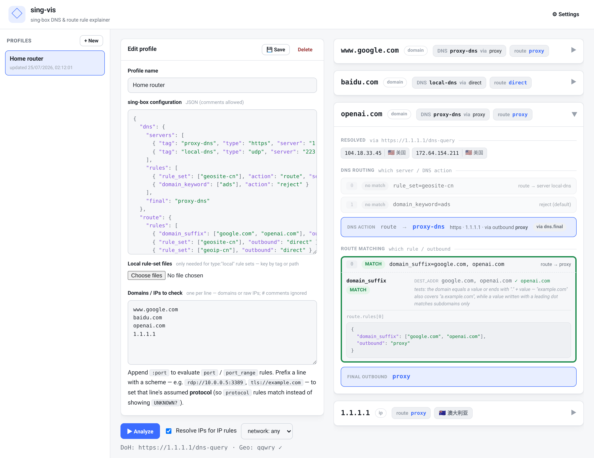

# sing-vis

> [!WARNING]
>
> This project utilizes a rewritten routing engine with best efforts to match sing-box's logics, and some results may not be accurate.

A web app that explains **how a [sing-box](https://github.com/SagerNet/sing-box) configuration routes a domain or IP**. Paste a sing-box JSON config, enter a list of domains/IPs, and sing-vis shows — for each one — which DNS rule and route rule it hits, every condition evaluated along the way, and the final DNS server and outbound.

It runs **entirely in your browser**: the matching engine is plain JavaScript, so there is no backend, nothing is uploaded, and you can host it as static files (including on GitHub Pages). The only WebAssembly is a tiny module that decodes sing-box's binary `.srs` rule-set format, and it's downloaded lazily — only if a config you analyze actually uses one.



## Quick start

No build step, no toolchain — the frontend is static files with no dependencies:

```bash
./run.sh                 # serves http://127.0.0.1:8787
./run.sh 9000            # custom port
./run.sh 0.0.0.0:9000    # custom host:port (expose on your LAN)
```

Open the printed URL. That's it. (`run.sh` just starts `python3 -m http.server` over `web/` — any static server works.)

The one optional piece is **binary (`.srs`) rule-set support**, which needs a small WebAssembly decoder. If you want it, run `./build.sh` once (requires Go) to produce `web/srs.wasm`; see [Building & hosting](#building--hosting). Everything else works with no Go at all.

## Using it

1. **Paste a config.** The editor opens pre-filled with a sample. Replace it with your own sing-box JSON in the config box (JSONC comments are fine), and give the profile a name.
2. **List what to check.** In *Domains / IPs to check*, put one host per line — domains (`www.google.com`) or raw IPs (`1.1.1.1`). Lines starting with `#` are ignored. Pasted URLs and `host:port` strings are accepted; a trailing `:port` (e.g. `example.com:443`, `[2606:4700:4700::1111]:853`) is **used** to evaluate `port` / `port_range` rules that would otherwise be undeterminable — omit it to leave those rules `UNKNOWN?`. A leading scheme (e.g. `rdp://10.0.0.5:3389`, `tls://example.com`) sets that line's assumed **protocol**, so `protocol` rules can be evaluated instead of shown as `UNKNOWN?`. Both the config box and this list are syntax-highlighted as you type.
3. **Click ▶ Analyze.** For every input you get:
   - **DNS routing** — which `dns.rules` rule matches, the resulting DNS **server** (or `reject`/other action), and the outbound **detour** that server is reached through. Traced for the `A` query, and — because applications resolve with happy eyeballs — again for the `AAAA` query the client sends alongside it, which `query_type` rules can route (or `reject`) differently. The AAAA trace is skipped for names with no AAAA records, and is shown in full only when its path actually differs from the A query's.
   - **Route matching** — every `route.rules` rule in order, each condition's result (**match** / no match / **`UNKNOWN?`**), which `rule_set` matched and on which headless rule, down to the **final outbound**. Shown **once per inbound**, behind a row of tabs — see *Inbounds & TUN capture* below.
   - **Resolved IPs** — the A/AAAA records fetched via DoH (shown when a domain is resolved).
   - **Geolocation** — every IP shown (resolved addresses and raw-IP inputs) is tagged with a country flag and location (归属地); see *IP geolocation* below.

   Click any result card to expand it, and any rule step to see its per-condition breakdown. Each condition also states **what it actually tests** (`domain_suffix` covering subdomains, `ip_cidr` in a DNS rule filtering the *answer* rather than the query, …), the step spells out **how the condition groups combined** into its verdict (groups are AND-ed, values inside one group OR-ed, and an `UNKNOWN?` survives the AND), and the **slice of your config** behind it — `route.rules[3]`, and the definition of any `rule_set` that took part in the verdict — is quoted underneath. A set that simply didn't match is left as a one-line "no match" instead, so a rule listing several sets doesn't bury its one hit under the others' definitions.
4. **Save the profile** with 💾. Profiles live in your browser (IndexedDB), persist across reloads, and appear in the left sidebar. Settings persist too. Everything stays on your machine.

### Toolbar options

- **Resolve IPs for IP rules** (on by default) — pre-resolves each domain via DoH so `ip_cidr` and IP rule-set rules match the resolved address, matching what you'd intuitively expect. Turn it off for strict sing-box semantics, where IP rules only match *after* an explicit `resolve` action.
- **network: any / tcp / udp** — an assumed connection network, so rules filtering on `network` can be evaluated.
- **⚙ Settings** — the DoH endpoint (default `https://1.1.1.1/dns-query`) with a **Test resolver** button that confirms the endpoint actually resolves from your browser, plus the IP-geolocation toggle and database URL.

### Conditions that can't be known offline

Some rule conditions depend on live connection attributes that don't exist for a "what would this domain do?" query — `process_name`, `clash_mode`, source address/port, etc. These show as **`UNKNOWN?`** (amber). Three are recoverable: append `:port` to an input to resolve `port` / `port_range` rules, prefix a line with a scheme (e.g. `rdp://`) to resolve `protocol` rules, and switch inbound tabs to resolve `inbound` rules. If an undeterminable **terminal** rule sits *before* the definite match, the outcome is flagged **"depends on assumptions"**, because at runtime that rule could preempt the result.

### Inbounds & TUN capture

The inbound a connection arrives on changes the answer twice over, so **Route matching** is traced once per inbound in `inbounds`, switchable with the tab row above the trace:

- **`inbound` rules become decidable.** Instead of an amber `UNKNOWN?`, an `inbound` condition is evaluated against the tab you're on — so you can see the same destination land on different outbounds depending on where it entered.
- **A TUN says whether sing-box sees the traffic at all.** With `auto_route`, the tunnel takes over the system default route, `route_exclude_address` punches holes back out of it, and `route_address` replaces it with an explicit allow-list (`route_address_set` / `route_exclude_address_set` contribute the destination `ip_cidr` rules of a rule-set, exactly as sing-box extracts them). A destination that falls outside leaves through the physical interface, so **no route rule ever runs on it** — a verdict no rule trace can express, and one the rules below would otherwise contradict. The tab is flagged and the trace dimmed, with the offending prefix named per resolved address.

  This is reported **only when something is in the way** — bypassed, partly bypassed, or undeterminable. An inbound that simply receives the traffic says nothing, so a panel appearing always means the destination didn't arrive normally.

  Prefix lists are matched **per address family**, as sing-box splits them before handing them to sing-tun: a `route_address` holding only IPv4 prefixes leaves IPv6 on the default route rather than excluding it, and a TUN with no IPv6 address gets no IPv6 route at all. The deprecated `inet4_*` / `inet6_*` spellings feed the same lists as the 1.10 fields that replaced them. Filters that gate capture per *process* rather than per address (`include_package`, `exclude_uid`, `include_interface`, …) can't be decided offline, so they're listed as caveats on the verdict.

If the config declares **no inbounds**, one `mixed` inbound is assumed, and its tab is marked `assumed`. Its tag is unknown, so `inbound` rules stay `UNKNOWN?` rather than reading as a no-match against an empty tag.

The chips on a collapsed card stay **inbound-agnostic** — they answer "what happens regardless of where this entered" — with a separate amber chip when some TUN would not receive the traffic at all.

### Rule sets

- **inline** — read straight from the config.
- **remote** — fetched live from its `url` (source `.json` or binary `.srs`, auto-detected). The URL must allow CORS (GitHub raw does).
- **local** — the browser can't read disk paths, so upload the file under *Local rule-set files* in the editor, keyed by the rule-set **tag** or its **path**. `.srs` is read as binary; anything else as source JSON.

Binary (`.srs`) rule sets are decoded by `web/srs.wasm` (loaded on demand). Since the decoder recovers the compiled rules back to their source form, sing-vis shows the **actual domains and CIDRs** a `.srs` set contains rather than an opaque "compiled set".

### IP geolocation

Every IP in the results — resolved addresses and raw-IP inputs alike — is annotated with a country flag and location (归属地) from the [metowolf/qqwry.ipdb](https://github.com/metowolf/qqwry.ipdb) database (IPIP.net `ipdb` format, IPv4 + IPv6; the flag comes from its ISO-3166 `country_code` field). The ~37 MB database is downloaded once from a CDN (default `https://cdn.jsdelivr.net/npm/qqwry.ipdb/qqwry.ipdb`), cached in your browser (IndexedDB), and queried entirely locally — **no IP is ever sent anywhere**. Toggle it off, or point it at a different `ipdb`-format URL, under **⚙ Settings**. The URL must allow CORS (the jsdelivr default does).

## Why it's faithful

sing-vis aims to reproduce sing-box's matching **semantics**, not a paraphrase of them:

- **The version-sensitive binary format reuses sing-box's own code.** The `.srs` decoder (`cmd/srsdecode`, compiled to `web/srs.wasm`) imports sing-box's `common/srs` reader and `sing/common/domain` succinct-set matcher and calls `srs.Read(recover: true)` — the upstream code path — to recover a compiled rule set back to plain `domain` / `domain_suffix` / `ip_cidr` rules. The hard, versioned binary parsing therefore tracks upstream by bumping the submodule.
- **The matcher's behaviour is pinned by tests.** Domain suffix/keyword semantics, first-terminal-match-wins, the `resolve → ip_cidr` lifecycle, `and`/`or`/`invert`, the `final` fallback, and TUN capture (per-family `route_address` / `route_exclude_address`, the `*_address_set` `ip_cidr`-only extraction) each have fixtures in `testdata/fixtures.json`, checked against golden results plus hand-written assertions.

**The honest caveat:** outside the `.srs` decoder, the matcher is a reimplementation, and its tests are *regression* tests — the goldens are generated by the same engine that is checked against them, so they catch unintended change, not disagreement with sing-box. Earlier versions compared against a Go engine in `internal/engine`, but that was a second hand-written reimplementation rather than sing-box's real routing code, so agreeing with it never proved much; it has been removed. Treat sing-vis as a very well-tested model of the documented semantics, not as ground truth — when a result surprises you, sing-box itself is the authority.

The JS engine owns the **orchestration** (AND across fields / OR within a field's array / logical rules / rule-set evaluation / DNS-then-route), which lets it **instrument** every step and report exactly which condition and rule-set matched. It deliberately reimplements the small, documented matchers (domain suffix/keyword/regex, CIDR containment, port ranges) in JavaScript rather than shipping sing-box's whole dependency tree to the browser.

> One intentional difference: for `.srs` rule sets, sing-box internally matches with an opaque compiled succinct-set, whereas sing-vis matches (and displays) the recovered source domains/CIDRs. The match results are identical; sing-vis just shows you the real values.

## Building & hosting

The site itself needs **no build** — `web/` is ready to serve as-is. The only build step produces the optional `.srs` decoder:

```bash
./build.sh                          # -> web/srs.wasm (+ .gz) and web/wasm_exec.js  (needs Go)
python3 -m http.server -d web 8787  # or any static server
```

After `build.sh`, the `web/` directory is completely self-contained. `web/srs.wasm`, `web/srs.wasm.gz`, and `web/wasm_exec.js` are generated artifacts (gitignored); regenerate them any time with `./build.sh`, or commit them so your host needs no Go. If you never analyze configs with binary (`.srs`) rule sets, you can skip the build entirely.

### GitHub Pages

`.github/workflows/pages.yml` publishes the site on every push to `master`: it checks out the sing-box submodule, runs `./build.sh` so the deployed site gets `.srs` support, gates the deploy on the Node test suite (`test/gen.mjs -check` plus the three test scripts), and uploads `web/` as the Pages artifact. Enable it once under **Settings → Pages → Source: “GitHub Actions”**; you can also trigger it by hand from the Actions tab. Nothing generated is committed — the decoder is rebuilt per deploy.

Every asset path in the app is relative, so a project page (`https://<user>.github.io/<repo>/`) works with no base-path configuration. To publish some other way, just serve `web/` — copy it to a `gh-pages` branch or a `docs/` folder and it will work the same.

### The wasm build patch

Three files in the `sing` dependency (`common/buf/buffer_unix.go`, `common/bufio/vectorised_unix.go`, `common/bufio/copy_direct_posix.go`) reference `golang.org/x/sys/unix`, which has no `GOARCH=wasm` equivalent. Those code paths (raw-socket `readv`/`writev`) never run in a browser.

The module cache is read-only and Go ≥ 1.25 refuses to overlay files beneath `GOMODCACHE`, so `build.sh` copies the `sing` module to `wasmbuild/.singtree/` (gitignored, re-staged when the version changes), drops the wasm-safe stubs from `wasmbuild/_stubs/` over those three files, and builds against a generated `go.wasm.mod` that `replace`s `sing` with the patched copy. **Only the wasm build sees the patch** — a native `go build ./cmd/srsdecode` uses the real `sing` and the unmodified `go.mod`.

## Testing

Everything is Node (≥ 20); only the `.srs` decoder needs Go, and only to rebuild `web/srs.wasm`:

```bash
node test/run.mjs                    # fixtures vs golden results, plus explicit assertions
node test/gen.mjs                    # (re)generate testdata/golden/*.json
node test/gen.mjs -check             # fail if any golden is stale (CI runs this)
node test/srs.mjs                    # binary (.srs) decode → match, end-to-end
node test/browser.mjs                # full worker stack: real srs.wasm + mocked fetch
```

The golden files are a **regression baseline, not an oracle** — `test/gen.mjs` writes them with the same engine `test/run.mjs` checks them against. A golden diff means behaviour *changed*; read it and only regenerate once you can explain every hunk. Behaviour that must be *correct* rather than merely *stable* belongs in a hand-written assertion at the bottom of `test/run.mjs`, where the expected value is spelled out and survives a careless regeneration.

Fixtures live in `testdata/fixtures.json`. Each case sets `config` and `inputs`, optionally `dns` (canned DoH answers), `ruleSetFiles`, `network`, `assumeResolved` (default **true**), and `assumeHttps` (default **false** here, though the app defaults it on — opt-in so the older fixtures keep exercising the "port/protocol unknown" branches).

## CORS

DoH resolution, remote rule-set fetches and the geo-database download originate from the browser, so those endpoints must send `Access-Control-Allow-Origin`. The defaults do — the bundled DoH presets (Cloudflare `https://1.1.1.1/dns-query`, Tencent DNSPod `https://sm2.doh.pub/dns-query`), `raw.githubusercontent.com`, and the jsdelivr CDN for qqwry.ipdb. Point sing-vis at an endpoint that doesn't, and that item shows a fetch error; swap it for a CORS-enabled one, or upload the rule-set file locally. The resolver uses the DoH **JSON API** (`?name=&type=&ct=application/dns-json`), a CORS "simple request" that avoids a preflight.

## Project layout

```
web/               static single-page frontend (no build step)
  index.html         markup
  app.js             UI + rendering (consumes the engine's Result JSON; reuses engine/parse.js to quote config excerpts)
  editor.js          JSON / host-list syntax highlighting (transparent-textarea overlay)
  geoip.js           qqwry.ipdb (IPIP.net ipdb format) reader for IP geolocation
  storage.js         profiles, settings & cached geo database in IndexedDB
  worker.js          Web Worker: loads the JS engine, runs analyze off the UI thread
  engine/            the pure-JS matching engine
    ip.js              IP parse + CIDR / is-private (netip-faithful, IPv4 + IPv6)
    parse.js           JSONC → normalized route/DNS rules, rule sets, servers, inbounds
    engine.js          conditions, rules, rule-set eval, TUN capture, route/dns orchestration, analyze
    browser.js         browser deps: DoH resolver, remote fetch, lazy srs.wasm loader
  srs.wasm           .srs decoder (built by build.sh; lazy-loaded; gitignored)

cmd/srsdecode/     .srs → source-rules decoder: wasm entry (browser) + native CLI (tests)
                   the only Go left in the project
test/              Node tests: harness.mjs (shared) + run/gen/srs/browser
testdata/          fixtures.json + golden/*.json (generated by test/gen.mjs)
wasmbuild/         wasm build support (unix→wasm stubs + staged sing copy)
sing-box/          upstream sing-box clone (imported via a go.mod replace)
.github/workflows/ pages.yml — build + test + publish web/ to GitHub Pages
```
